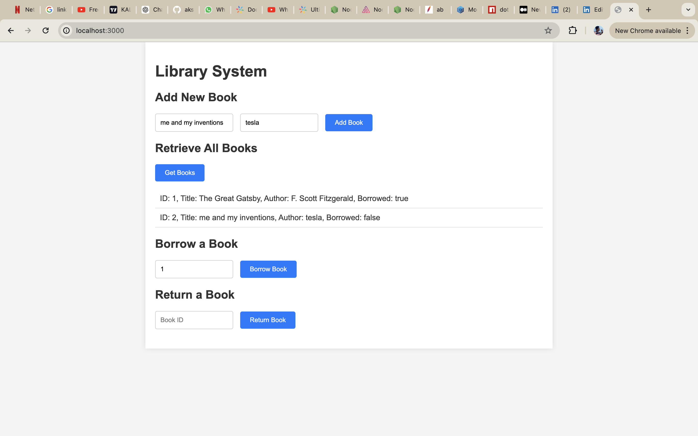

```markdown
# Library System

This is a simple library system built with Node.js, following the SOLID design principles. It allows you to manage books in a library, including adding new books, retrieving a list of all books, borrowing books, and returning books.

## Features

- Add a new book
- Retrieve a list of all books
- Borrow a book
- Return a book

## Project Structure

library-system/
├── src/
│   ├── controllers/
│   │   ├── bookController.js
│   ├── models/
│   │   ├── book.js
│   ├── repositories/
│   │   ├── bookRepository.js
│   ├── services/
│   │   ├── bookService.js
│   ├── routes/
│   │   ├── bookRoutes.js
│   ├── public/
│   │   ├── index.html
│   ├── app.js
├── package.json
├── .gitignore
├── Dockerfile
├── docker-compose.yml
├── README.md
└── assets/
    ├── ui_screenshot.png

## Installation

1. Clone the repository:

   ```sh
   git clone https://github.com/your-username/library-system.git
   cd library-system
   ```

2. Install dependencies:

   ```sh
   npm install
   ```

## Usage

1. **Start the server locally:**

   ```sh
   node src/app.js
   ```

   The server will start and listen on port 3000. You can interact with the API using the following endpoints:

   ### Endpoints

   - **Add a new book**
     - **URL:** `POST /api/books`
     - **Body:**
       ```json
       {
         "id": "1",
         "title": "The Great Gatsby",
         "author": "F. Scott Fitzgerald"
       }
       ```
     - **Response:** `201 Created`

   - **Get all books**
     - **URL:** `GET /api/books`
     - **Response:** `200 OK`
       ```json
       [
         {
           "id": "1",
           "title": "The Great Gatsby",
           "author": "F. Scott Fitzgerald",
           "isBorrowed": false
         }
       ]
       ```

   - **Borrow a book**
     - **URL:** `PUT /api/books/borrow/:id`
     - **Response:** `200 OK` or `400 Bad Request`

   - **Return a book**
     - **URL:** `PUT /api/books/return/:id`
     - **Response:** `200 OK` or `400 Bad Request`

2. **Start with Docker:**

   Ensure you have Docker and Docker Compose installed.

   - **Build and run the Docker containers:**

     ```sh
     docker-compose up --build
     ```

   - **Access the application:**

     The application will be accessible at `http://localhost:3000`.

3. **Access the UI:**

   - **Open your web browser and navigate to `http://localhost:3000`** to view the UI for the Library System.

## UI Screenshot

Below is a screenshot of the Library System's UI:


## Docker Setup

### Dockerfile

This Dockerfile sets up the Node.js environment for the application.

```Dockerfile
# Use the official Node.js image.
FROM node:16

# Set the working directory.
WORKDIR /usr/src/app

# Copy package.json and package-lock.json.
COPY package*.json ./

# Install dependencies.
RUN npm install

# Copy the rest of the application code.
COPY . .

# Expose port 3000.
EXPOSE 3000

# Start the application.
CMD ["node", "src/app.js"]
```

### docker-compose.yml

This Docker Compose configuration sets up both the Node.js application and MySQL.

```yaml
version: '3.8'

services:
  app:
    build: .
    ports:
      - "3000:3000"
    environment:
      DB_NAME: librarydb
      DB_USER: root
      DB_PASSWORD: example
      DB_HOST: db
    depends_on:
      - db

  db:
    image: mysql:5.7
    environment:
      MYSQL_ROOT_PASSWORD: example
      MYSQL_DATABASE: librarydb
    ports:
      - "3306:3306"
```

## Environment Variables

Ensure you have a `.env` file in the root of your project with the following variables:

```
DB_NAME=librarydb
DB_USER=root
DB_PASSWORD=example
DB_HOST=db
```

## Design Principles

This project adheres to the SOLID design principles:

1. **Single Responsibility Principle (SRP):** Each class has a single responsibility, making the codebase easier to understand and maintain.
2. **Open/Closed Principle (OCP):** The system is designed to be extensible without modifying existing code, reducing the risk of introducing bugs.
3. **Liskov Substitution Principle (LSP):** Subclasses can be used interchangeably with their base classes, ensuring reliability.
4. **Interface Segregation Principle (ISP):** Interfaces are small and specific, reducing the implementation burden on classes.
5. **Dependency Inversion Principle (DIP):** High-level modules depend on abstractions rather than concrete implementations, promoting flexibility and ease of testing.

## Contributing

Contributions are welcome! Please fork the repository and submit a pull request with your changes.

## License

This project is licensed under the MIT License. See the [LICENSE](LICENSE) file for details.
